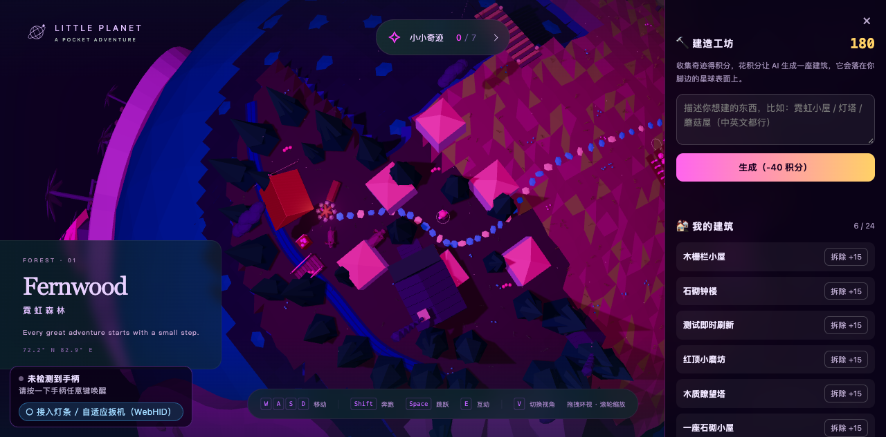

# 口袋星球 · 双人合作版（Little Planet Controller）

《口袋星球》是一款赛博朋克风格的低多边形 3D 探索游戏：漫步霓虹草原、工业绿洲与珊瑚礁，
收集散落全岛的 7 个数字奇迹。本仓库在**不改动游戏本体一行代码**的前提下，给它套上了
一层桥接工程，带来三个新能力：

| 能力 | 说明 |
| --- | --- |
| 👥 **双人合作模式** | 一块屏幕分给两位玩家（P1 键鼠 + P2 手柄），独立存档、互相报方位，还有汇总板 / 速度赛 / 信标三种玩法面板 |
| 🎮 **PS5 DualSense 深度适配** | 输入映射、事件震动、灯条配色、自适应扳机，全部通过 WebHID 实现 |
| ☀️ **一键昼夜切换** | 同一座岛两套时间，白天版按官方昼夜配色逐项映射生成，切换不丢进度 |
| 🪐 **赛博星球** | 100 万顶点高精度星球模型替换地表，运行时一键切换昼夜（不重载），单人双人都支持 |

游戏打开后，右上角有 **「👥 双人模式」** 按钮，点一下即进入双人合作版 —— 不需要记任何地址。

---

## 🌐 在线即玩（无需安装）

**👉 https://duoduozhang288-crypto.github.io/little-planet-controller/**

| 页面 | 地址 |
| --- | --- |
| 🌙 单人 · 原版星球 | [打开](https://duoduozhang288-crypto.github.io/little-planet-controller/) |
| ☀️ 单人 · 原版白天 | [打开](https://duoduozhang288-crypto.github.io/little-planet-controller/?theme=day) |
| 🪐 **单人 · 赛博星球** | [打开](https://duoduozhang288-crypto.github.io/little-planet-controller/?planet=cyber) |
| 👥 双人 · 赛博星球 | [打开](https://duoduozhang288-crypto.github.io/little-planet-controller/duo.html?planet=cyber) |

> 首次进入赛博星球需要下载约 57MB 的高精度模型，加载时有进度遮罩，之后浏览器会缓存。
> 在线版手柄适配（WebHID）需要 Chrome / Edge 浏览器；键鼠在所有现代浏览器可用。

---

## 如何启动游戏（本地版）

需要 [Node.js](https://nodejs.org)（建议 18 以上），**不需要 npm install**，服务器零第三方依赖。

**方式一：一键启动（双击）**

- Windows：双击 `start.bat`
- macOS：双击 `start.command`

**方式二：命令行**

```bash
cd little-planet-controller
node server/server.js
```

服务器起来后会自动（或手动）打开浏览器：

| 页面 | 地址 |
| --- | --- |
| 🌙 单人模式（默认夜晚） | `http://localhost:8765/` |
| ☀️ 单人模式 · 白天 | `http://localhost:8765/?theme=day` |
| 🪐 单人 · 赛博星球 | `http://localhost:8765/?planet=cyber` |
| 👥 **双人合作模式** | `http://localhost:8765/duo.html` |
| 👥🪐 双人 · 赛博星球 | `http://localhost:8765/duo.html?planet=cyber` |
| 🔍 手柄适配自检（39 项） | `http://localhost:8765/bridge/ds5-selftest.html` |
| 🔍 双人分屏自检（52 项） | `http://localhost:8765/bridge/duo-selftest.html` |

> 单人页右上角的「👥 双人模式」按钮与「☀️ 白天 / 🌙 夜晚」按钮就是这些入口的快捷方式。

> ⚠️ 必须通过 `http://localhost:8765/` 访问，不要直接双击 HTML 文件：
> 游戏用了 ES Module，浏览器不允许从 `file://` 加载模块。

---

## 三种验证方式

### 1. 自动演示（验证链路是否通）

再开一个终端：

```bash
node server/mock-backend.js demo
```

页面里的角色会自动跑动、跳跃、转向、切换视角。

### 2. 键盘实时操控（推荐联调时使用）

```bash
node server/mock-backend.js
```

```
W A S D 移动 | Shift 奔跑 | 空格 跳跃 | E 互动 | V 视角
Q 转视角 | Z 拉近 | X 拉远 | R 重置 | Ctrl+C 退出
```

它扮演的就是"后端"，验证的是「后端 → 网页」整条链路。

### 3. 用 curl 直接发一条指令

```bash
curl -X POST http://localhost:8765/input \
  -H "Content-Type: application/json" \
  -d '{"type":"state","move":[0,-1]}'
```

返回 `{"ok":true,"delivered":1,"clients":1}` 说明指令已送达页面。

---

## 手柄怎么玩（PS5 DualSense）

页面已内置 DualSense 适配。打开页面后**按一下手柄任意按键**唤醒，左下角会显示手柄状态，
右下角弹出按键提示卡。核心映射：

```
左摇杆/十字键 移动 | 右摇杆 环视 | × 跳跃 | □ 互动 | △ 换视角 | ○ 取消
L2 奔跑 | R2/R1 拉近 | L1 拉远 | 触摸板 镜头回正 | L3 回草原 | R3 取消
Options 手记 | Create 说明
```

带震动反馈（跳跃、收集、进入区域、可互动提示等）。实现全部在
`web/bridge/ds5-adapter.js`，**游戏本体与 `lp-controller.js` 未做改动**。

自检页（不需要手柄也能跑）：

```
http://localhost:8765/bridge/ds5-selftest.html
```

完整按键表、震动模式清单、可调参数与调试 API 见 [`docs/DS5.md`](docs/DS5.md)。

手柄没反应时，除了先按一下按键唤醒，也可以在控制台执行 `DS5.status()` 查看识别情况。

---

## 双人合作模式（两位玩家一台电脑）

同一个游戏，一块屏幕分给两位玩家。**游戏本体依旧一行未改。**

**入口**：单人页右上角「👥 双人模式」按钮，或直接打开

```
http://localhost:8765/duo.html
```

左边 P1 用键鼠，右边 P2 用手柄；插两只手柄就各拿一只。顶栏实时显示双方的坐标、
所在区域、奇迹进度，以及「P2 在 P1 的哪个方向」。右上角可切换左右 / 上下布局。

顶栏下还有一行**玩法面板**，把双方数据派生成三种玩法：

- **汇总板** —— 双方累计移动距离、换区次数、对局总用时（全自动）
- **速度赛** —— 点「开始计时」后谁先集齐 7 个奇迹谁胜，进度条实时走（可选）
- **信标** —— 对方进入新区域或收到奇迹时弹 8 秒提示（全自动）

| 检测到的手柄 | P1（左屏） | P2（右屏） |
| --- | --- | --- |
| 1 只 | 键鼠 | 这唯一的一只 |
| 2 只及以上 | 第 1 只 | 第 2 只 |

两位玩家各存各的手记进度，互不覆盖。键盘永远只控制 P1。

有一个必须说清楚的限制：**两位玩家互相看不见**。游戏是打包好的单机版本，只有一个角色
和一台相机，不改本体就放不下第二个角色 —— 所以两人跑的是两个独立的世界实例，
地图与地标完全相同，靠顶栏的坐标与方位互相找路（配合语音通话体验最好）。

玩法细节、归属规则与已知限制见 [`docs/DUO.md`](docs/DUO.md)。自检页（不需要手柄也能跑）：

```
http://localhost:8765/bridge/duo-selftest.html
```

---

## 昼夜切换（一键换时间）

同一个岛，两套时间。**游戏本体依旧一行未改** —— 白天版是按官方昼夜配色
逐项映射生成的副本资源（`assets/index-day-*.js` / `index-day-*.css`），
页面按 `?theme=day` 二选一加载。

- **单人**：任意页面右上角的「☀️ 白天 / 🌙 夜晚」按钮，点了整页重载，**手记进度不丢**
- **双人**：顶栏「☀️ 白天 / 🌙 夜晚」按钮，两个画面**同时**换主题（座位里不放按钮，避免两人切不到一起）
- 也可以直接用地址：`http://localhost:8765/?theme=day`、`http://localhost:8765/duo.html?theme=day`

天空、雾、阳光、建筑与屋顶色板、水面、UI 玻璃色全部随主题切换；
极光与霓虹粒子的品红在白天版刻意保留（官方白天版也是如此）。

---

## 🪐 赛博星球（高精度模型）

在原版星球之外，还可以切换到一颗 **100 万顶点 / 189 万三角面** 的高精度赛博星球
（模型已离线贴合到角色行走球面，角色、碰撞、寻路、交互点全部沿用原游戏逻辑）。

**入口**：任意页面右上角的「🪐 赛博星球」按钮，点击后整页重载，**手记进度不丢**；
在赛博星球里同一个按钮变成「🪐 原版星球」，一键切回。

| 页面 | 地址 |
| --- | --- |
| 单人 · 赛博星球 | `http://localhost:8765/?planet=cyber` |
| 双人 · 赛博星球 | `http://localhost:8765/duo.html?planet=cyber` |

赛博星球自带**运行时昼夜切换**（不重载页面）：

- **单人**：右上角「☀️ / 🌙」按钮同时切换贴图、灯光、天空渐变与大气雾
- **双人**：顶栏按钮**同时**切换两个座位的昼夜，按钮文字实时同步
- 白天还有三套日光贴图可选（A 清晨微冷 / B 正午晴日 / C 午后暖阳），默认 A

实现原则与整套工程一致：**游戏本体零改动** —— 赛博星球是副本 bundle
（`assets/index-cyber-*.js`，仅多 51 字节场景钩子）+ 集成层
（`integration/cyber-planet.js` 隐藏原地表并摆放模型、`integration/daylight-mode.js`
运行时昼夜）。模型与工具链见 [`docs/MODEL.md`](docs/MODEL.md) 与
[`docs/DAYLIGHT.md`](docs/DAYLIGHT.md)。

### URL 参数速查

| 参数 | 作用 |
| --- | --- |
| （无） | 原版星球 · 夜晚 |
| `?theme=day` | 原版星球 · 白天（整页重载切换） |
| `?planet=cyber` | 赛博星球（默认白天） |
| `?planet=cyber&mode=night` | 赛博星球 · 夜景 |
| `?planet=cyber&day=B` | 赛博星球 · 指定白天贴图（A / B / C） |
| `?seat=1` / `?seat=2` | 双人模式座位（由 duo.html 自动附加） |
| `?build=1` | 打开建造模式（右上角出现「🔨 建造」入口） |
| `?bgm=0` | 背景音乐静音开场（默认跟随上次选择） |

参数可组合：`duo.html?planet=cyber` 会把星球参数转发给两个座位。

---

## 🎵 背景音乐（无缝无限循环）

游戏自带一段赛博科幻氛围 BGM，**53.5 秒一轮、首尾无接缝**。右上角「♪ 音乐」按钮
或按 **M 键**开关，状态记在 localStorage，下次打开保持上次选择。

浏览器不允许带声音自动播放，所以**第一次点击或按键之后**才会起声 —— 这不是 bug。

### 音频是怎么来的

原素材是一段 60 秒的视频音轨，不能拿来直接循环，有两个坑：

1. 结尾 2 秒是淡出（电平掉到 -51dB），直接 loop 会每轮"喘一口气"；
2. 就算切掉淡出，结尾采样接到开头采样波形不连续，每轮"咔哒"一声。

`tools/make-bgm-loop.mjs` 的处理：先找一个**频谱上接得上**的循环点（53.50s，
32 频段能量指纹相似度 0.996、电平差 0.0dB），再把尾段 3 秒**等功率交叉淡化**回开头。
成品接缝跳变 0.00134，比相邻采样的平均跳变（0.00203）还小。

```bash
node tools/make-bgm-loop.mjs ~/Desktop/spider_bgm_scifi_1min.mp4
# -> web/bgm/bgm-loop.ogg（主用，Vorbis 天然无缝）
# -> web/bgm/bgm-loop.mp3（兜底，不支持 ogg 的浏览器）
```

可选参数：`--at 53.5` 指定循环点、`--fade 3` 淡化长度、`--start 0.35` 起点、`--out <前缀>`。

> 挑循环点时**不要用波形互相关**：氛围电子乐的典型情况是"包络循环、音符不重复"，
> 波形相关普遍只有 0.2 左右，根本找不到采样级完美接点。要看频谱相似度。

### 播放实现

优先走 Web Audio：整个文件解码成 `AudioBuffer` 后用 `BufferSource.loop` 循环 ——
采样级精确，不会因解码器补零在接缝处咯噔一下。拿不到 `AudioBuffer` 才退到
`<audio loop>`。离线单文件版没有 `bgm/` 目录可加载，构建时把音频以 data URI
写进 `window.LPBGM_SRC`，`file://` 下同样有音乐。

---

## 🔨 建造工坊（收集奇迹 → 生成建筑）

`?build=1` 打开建造模式后，右上角出现「🔨 建造」按钮：

```
收集奇迹(+30)  →  积分池  →  生成建筑(-40)  →  摆在脚边  →  拆除返还(+15)
```

- **零依赖接入**：页面是打包产物，没有 `THREE` 命名空间也没有 `GLTFLoader`，
  桥接层从场景实例反推构造器并自写 glTF 解析器（`web/bridge/tripo-build.js`）
- **建筑自动贴地**：用 `world.surface(dir)` 取真实地表半径，按径向朝上摆放，
  不悬空、不陷入、自动避开水面
- **存档**：建筑清单存 localStorage，刷新后自动重建
- **相同描述不重复扣费**：服务端按 `描述|模型|面数|贴图` 做缓存，
  同一个描述第二次生成实测 **62 ms** 返回（首次真实生成 2357 ms）
- **没有 API Key 也能玩**：服务端自动进 mock 模式，用占位小屋走完整条链路，
  接上 Key 就换成真模型，前端一行不用改

```bash
TRIPO_API_KEY=tsk_xxxxxxxx node server/server.js   # 接真实 Tripo 3D 生成
node server/server.js                              # 不配 Key → mock 模式
```

**自己动手验一遍**（三个脚本都用隔离目录 + 强制 mock，不会真扣费）：

```bash
node tests/run.mjs                 # 全套 220 项，含缓存 35 项
node tools/verify-build-e2e.mjs    # 真开 Chrome：收集 → 生成 → 摆上星球 → 刷新恢复
node tools/verify-fresh-clone.mjs  # 从 GitHub 拉干净副本，验证「clone 下来就能跑」
```

第三个值得单独说：本地工作区里躺着已生成的建筑和一堆未入库的产物，
很容易掩盖「某个必需文件其实被 gitignore 掉了」这类问题。它会真的克隆一份到临时目录，
按上面的步骤走一遍全套，再起服务器真的生成一个模型取回来。



完整做法、经济参数、以及**那个"网格一个三角形都画不出来却不报错"的坑**
（`Float32BufferAttribute` 偷偷把索引数组转成浮点）见
[`docs/TRIPO.md`](docs/TRIPO.md)。

---

## 后端怎么接

后端只需要向一个地址 POST JSON。完整字段说明见 [`docs/PROTOCOL.md`](docs/PROTOCOL.md)。

```bash
POST http://localhost:8765/input
Content-Type: application/json

{ "type": "state", "move": [0, -1], "hold": ["run"], "taps": ["jump"] }
```

| 字段 | 含义 |
| --- | --- |
| `move` | 移动向量 `[x, y]`，`x` 右为正，`y` 前为负 |
| `look` | 视角向量 `[x, y]`，`0` 表示停止转动 |
| `zoom` | 缩放速率，正数拉近 |
| `hold` | 持续按住的动作，如 `["run"]` |
| `taps` | 触发一次的动作，如 `["jump"]` |

可用动作：`jump` `interact` `run` `view` `journal` `help` `home` `cancel`

参考实现已经写好两份，可以直接改：

- Node 版：[`server/mock-backend.js`](server/mock-backend.js)
- Python 版：[`server/example_python.py`](server/example_python.py)

Python 版零依赖，直接运行：

```bash
python3 server/example_python.py demo     # 自动演示
python3 server/example_python.py          # 手动发指令
```

---

## 文件结构

```
little-planet-controller/
├── README.md                     本文件
├── start.command                 macOS 双击一键启动
├── start.bat                     Windows 双击一键启动
├── web/                          网页端（服务器静态目录）
│   ├── index.html                游戏页面，已接入桥接脚本
│   ├── duo.html                  双人合作模式宿主页
│   ├── bridge/
│   │   ├── lp-controller.js      输入桥接层（键盘合成 + 后端 WebSocket）
│   │   ├── dualsense.js          DS5 硬件库（WebHID 报文：灯条 / 扳机 / 振动）
│   │   ├── lp-dualsense.js       DS5 硬件输出层（灯条配色、自适应扳机、连续振动）
│   │   ├── ds5-adapter.js        DualSense 输入适配层（按键 + 事件振动 + HUD）
│   │   ├── duo-pads.js           双人手柄归属规则（宿主与座位共用）
│   │   ├── duo-seat.js           双人座位接线（存档隔离 / 手柄来源 / 键盘防护）
│   │   ├── duo-modes.js          双人玩法面板（汇总板 / 速度赛 / 信标）
│   │   ├── duo-entry.js          双人模式入口按钮（单人页右上角）
│   │   ├── day-night.js          昼夜切换按钮（单人页右上角，按星球分流）
│   │   ├── planet-switch.js      星球切换按钮（原版 ↔ 赛博星球）
│   │   ├── tripo-build.js        建造工坊（构造器反推 + GLB 解析 + 球面摆放 + 积分/存档）
│   │   ├── bgm.js                背景音乐（Web Audio 采样级循环 + 开关按钮 + M 键）
│   │   ├── ds5-selftest.html     手柄适配自检页，39 项断言
│   │   └── duo-selftest.html     双人分屏自检页，52 项断言
│   ├── integration/              赛博星球集成层（游戏本体零改动）
│   │   ├── cyber-planet.js       隐藏原地表 + 加载 GLB 模型（esbuild 打包版）
│   │   ├── cyber-planet-source.js 集成层源码（175 行，注释完整）
│   │   └── daylight-mode.js      赛博星球运行时昼夜切换（贴图/灯光/天空/雾）
│   ├── bgm/
│   │   ├── bgm-loop.ogg          背景音乐主用（53.5s 无缝循环，Vorbis）
│   │   └── bgm-loop.mp3          兜底（不支持 ogg 的浏览器）
│   ├── models/
│   │   └── cyber-planet.glb      赛博星球高精度模型（约 57MB，100 万顶点）
│   ├── textures/                 赛博星球白天贴图（A / B / C 三套日光色）
│   └── assets/                   游戏本体与 Three.js 渲染库
│       ├── index-CS6g4Xtd.js     游戏逻辑（夜晚版，官方原文件）
│       ├── index-day-CS6g4Xtd.js 游戏逻辑（白天版，按官方昼夜配色映射生成）
│       ├── index-cyber-CS6g4Xtd.js 赛博星球副本（多 51 字节场景钩子）
│       ├── index-tripo-CS6g4Xtd.js 建造模式副本（多场景钩子，供 tripo-build.js 用）
│       ├── index-CundtmH4.css    样式（夜晚版）
│       ├── index-day-CundtmH4.css 样式（白天版）
│       └── three-gtj_l2uB.js     三维渲染库
├── server/
│   ├── server.js                 联调服务器，零依赖
│   ├── tripo.js                  Tripo 3D 生成代理（含无 Key 的 mock 模型）
│   ├── mock-backend.js           模拟后端，交互式操控
│   └── example_python.py         Python 对接示例
├── tools/
│   ├── gen-day-assets.py         白天版资源生成脚本（映射规则可复现）
│   ├── add-lp-hook.mjs           给打包产物注入场景钩子（生成建造模式副本）
│   ├── make-perf-model.mjs       生成高面数压测 GLB
│   ├── make-bgm-loop.mjs         从视频音轨加工出无缝循环 BGM（找循环点 + 交叉淡化）
│   ├── fit-planet.mjs            离线算模型-星球贴合参数
│   ├── fixtures/                 测试夹具 GLB（带贴图 / 真实 Tripo 子集 / 压测）
│   ├── build-ds5-standalone-html.mjs 离线单文件版打包脚本
│   ├── verify-ds5-hardware.mjs   DS5 硬件输出验证脚本
│   ├── verify-build-e2e.mjs      建造工坊端到端验证（真开 Chrome）
│   ├── verify-fresh-clone.mjs    全新克隆冒烟测试（拉干净副本跑一遍）
│   └── record-demo.mjs           录演示视频（Chrome headless + CDP 逐帧抓）
├── tests/                        自动化测试（node tests/run.mjs，220 项）
└── docs/
    ├── PROTOCOL.md               完整接口协议
    ├── TRIPO.md                  建造工坊：Tripo 接入、球面贴合、验收方法
    ├── DS5.md                    DualSense 按键表、震动反馈与调试 API
    └── DUO.md                    双人合作玩法、归属规则与已知限制
```

---

## 各文件职责

### `web/bridge/lp-controller.js`

整个包唯一需要理解的文件。它做三件事：

1. **接管手柄**：读取浏览器 Gamepad API，映射为游戏操作
2. **接收后端指令**：WebSocket 连接、自动重连、消息解析
3. **合成输入事件**：游戏通过 `keydown` / `pointermove` / `wheel` 接收输入，
   桥接层构造同类型事件派发过去，因此游戏代码无需改动

文件顶部集中定义了所有映射关系，需要调整按键时只改那里：

```js
var ACTION_KEY = {
  jump: "Space", interact: "KeyE", run: "ShiftLeft", view: "KeyV",
  journal: "KeyJ", help: "KeyH", home: "Home", cancel: "Escape"
};
```

### `server/server.js`

一个进程提供四件事，零第三方依赖：

| 地址 | 用途 |
| --- | --- |
| `GET /` | 托管游戏页面 |
| `WS /ws` | 浏览器实时通道 |
| `POST /input` | 后端注入口（推荐） |
| `GET /status` | 查看当前连接情况 |

WebSocket 部分是手写的最小实现，因此不需要安装 `ws` 之类的库，
适合在没有网络的现场环境直接运行。

改端口：

```bash
PORT=9000 node server/server.js
```

---

## 常见问题

**页面打开后是黑屏或一直显示"正在启动"**

必须通过 `http://localhost:8765/` 访问，不要直接双击 HTML 文件。
游戏用了 ES Module，浏览器不允许从 `file://` 加载模块。

**状态浮条显示"后端未连接"**

页面本身没问题，只是还没有后端接入。运行 `node server/mock-backend.js` 后会自动连上。

**`delivered` 一直是 0**

说明没有页面在监听。先确认游戏页面已经打开。

**手柄没有反应**

先按一下手柄上的任意按键唤醒，浏览器需要一次交互才会识别手柄。
可以在页面控制台执行 `DS5.status()` 查看手柄识别、震动与输入情况
（后端通道状态看 `LPController.status()`）。

**双人分屏里有一位的画面不动 / 手柄没反应**

先看顶栏写了什么：它会明确标出「已识别 N 只 · P1 ← 手柄 X · P2 ← 手柄 Y」。
显示「未检测到手柄」就按一下手柄任意键唤醒。键盘只控制 P1，点右边画面不会把键鼠
切过去；想让键盘重新生效，点一下左边画面即可。

**从别的电脑访问**

把 `localhost` 换成本机内网 IP。桥接层会自动使用当前域名推导 WebSocket 地址，无需改代码。

---

## 给后端的接入清单

1. 拿到本目录，运行 `node server/server.js`
2. 浏览器打开 `http://localhost:8765/`，确认游戏正常显示
3. 运行 `node server/mock-backend.js demo`，确认角色会自己动
4. 阅读 `docs/PROTOCOL.md`
5. 把自己的数据源替换进 `mock-backend.js` 或 `example_python.py` 的发送逻辑
6. 需要改按键映射时，改 `web/bridge/lp-controller.js` 顶部的 `ACTION_KEY`
