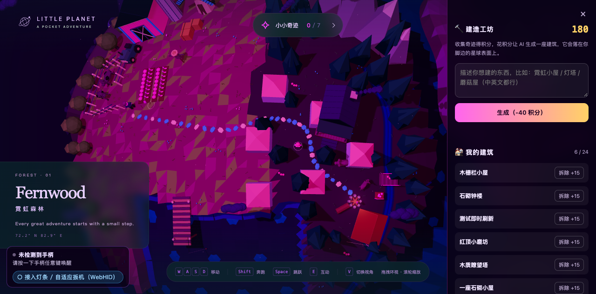
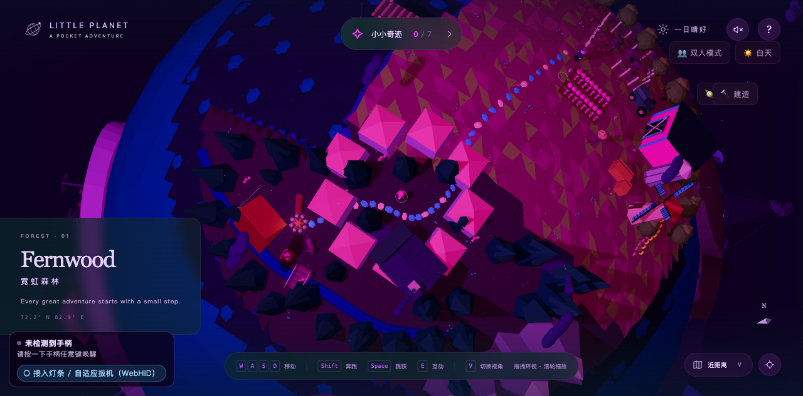
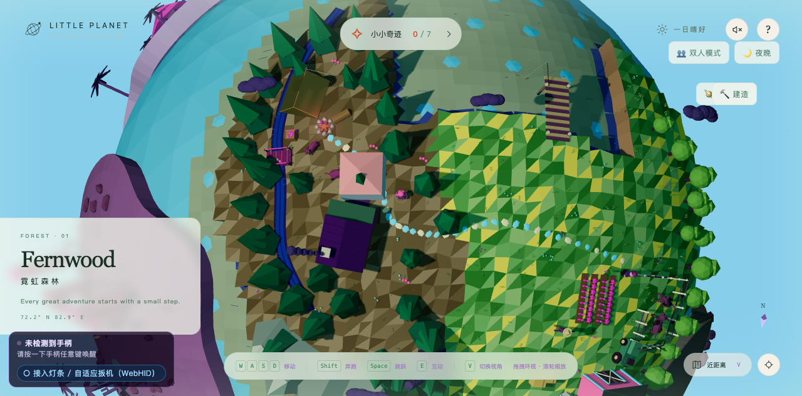
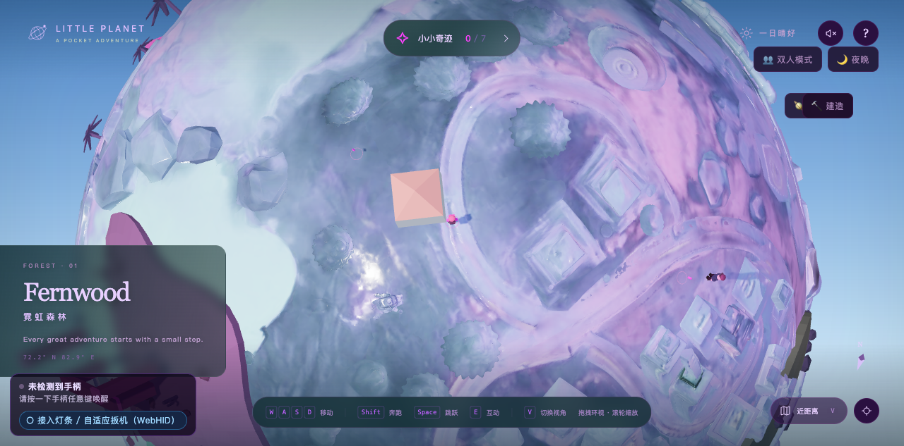

# Tripo 建筑生成玩法说明

记录「收集奇迹 → 攒积分 → 生成建筑 → 摆在星球上」这条闭环的完整做法，
接真 API Key、改经济数值、或排查"建筑看不见"时看这份。

---

## 一、玩法闭环

```
收集奇迹(#collected-count 变化)
        │  +30 积分/个
        ▼
    积分池（localStorage）
        │  -40 积分/次
        ▼
 Tripo 生成任务（异步轮询）
        │  GLB 落盘
        ▼
 摆到星球地表（角色附近 2.2~3.6 单位）
        │
        ├─ 存档 localStorage，刷新自动重建
        └─ 拆除返还 +15 积分
```

经济数值都在 `web/bridge/tripo-build.js` 顶部的 `CFG`：

| 参数 | 值 | 说明 |
| --- | --- | --- |
| `START_CREDITS` | 20 | 初始积分（不够生成一次，引导玩家先去收集） |
| `PER_COLLECT` | 30 | 每收集一个奇迹 |
| `COST` | 40 | 生成一次消耗 |
| `REFUND` | 15 | 拆除返还（低于成本，防止刷积分） |
| `TARGET_H` | 3.0 | 建筑目标高度（角色身高约 1.56） |
| `MAX_BUILDINGS` | 24 | 上限，避免刷屏 |

> 扣费写在 **`generateAndPlace()` 里**，不在面板按钮里。
> 面板 / 快捷键 / 调试 API 任何入口生成都必然先扣费，失败原额退还。
> 早期版本把扣费放在按钮事件里，结果是 `spend()` 定义了却从未被调用 ——
> 积分只增不减，等于无限免费生成。

---

## 二、接入真 API Key

Key 只留在服务端，绝不进浏览器。

```bash
TRIPO_API_KEY=tsk_xxxxxxxx \
PORT=8765 node server/server.js
```

嫌每次敲 Key 麻烦（也会留在 shell 历史里），可以把 Key 存成项目根目录的
`.tripo-key` 文件，双击 `start.command` 会自动读取：

```bash
echo 'tsk_xxxxxxxx' > .tripo-key     # 该文件已在 .gitignore 中，不会入库
```

没配 Key 时自动进 **mock 模式**：服务端用纯几何拼一座小屋（山墙 + 锥顶），
走完整条「提交任务 → 轮询 → 落盘 → 前端加载」的链路，只是模型是占位的。
所以**没有 Key 也能把玩法调通**，接上 Key 就换成真模型，前端一行不用改。

`GET /api/tripo/config` 会返回当前状态：

```json
{ "ok": true, "mock": true, "hasKey": false, "model": "v3.1-20260211", "faceLimit": 8000 }
```

`mock: true` 就说明还在用占位模型。

### 已真机验证过的部分

拿真实 Key 打到 `https://openapi.tripo3d.ai/v3` 实测确认：

| 项目 | 结果 |
| --- | --- |
| 鉴权 | 通过（无效 Key 会被挡在更早一层，不会走到业务参数校验） |
| 文生模型端点 | `POST /v3/generation/text-to-model` 正确 |
| 查询任务端点 | `GET /v3/tasks/{task_id}`，`task_id` 必须是 UUID |
| 默认模型 `v3.1-20260211` | 在允许列表内 |

**注意 `model` 是必填项** —— 不传会直接报 1004。目前允许的模型：

```
P1-20260311  P2-20260801  v2.5-20250123  v3.0-20250812  v3.1-20260211
```

其中 **P1 / P2 是游戏向变体**（拓扑更干净、面数更低、也更便宜），做游戏道具
优先选它；v3.x 是高质量变体，代价是更贵、面数更高。用 `TRIPO_MODEL` 切换：

```bash
TRIPO_MODEL=P1-20260311 node server/server.js
```

### 额度与省钱

Tripo 是**预付费**制，没有余额就是 `code 2010`，连最便宜的配置也跑不动
（实测 `v2.5` + 无贴图 + `face_limit=1000` 同样被拒，说明是余额真为 0，
而不是某个参数太贵）。

单次消耗大致随「模型档次 × 是否生成贴图」浮动，文生模型约 10~40 积分。
免费档每月约 200 积分 —— 按默认配置（v3.1 + 贴图，约 30~40）**只能生成五六座**，
而且玩家理论上能一直刷到上限 24 座。省钱的办法：

| 手段 | 说明 |
| --- | --- |
| 用 `TRIPO_MODEL=P1-20260311` | 游戏向变体，更便宜且拓扑更适合实时渲染 |
| 调低 `TRIPO_FACE_LIMIT` | 星球上建筑很小，3000 面完全够看，默认是 8000 |
| 服务端缓存 prompt | 相同描述直接复用已生成的 GLB，不重复扣费 |

最后一条最有效：这个玩法的描述词离散度其实很低（玩家来来回回就那几十种房子），
缓存命中率会很高。**建议真上线前把这一条做掉。**

### 错误码

服务端会把上游错误码翻译成人话（见 `server/tripo.js` 的 `CODE_HINT`）：

| code | 含义 | 怎么处理 |
| --- | --- | --- |
| 1001 / 1002 | Key 无效或权限不足 | 检查 `TRIPO_API_KEY` |
| 1004 | 参数不合法 | 常见是漏了 `model`，或 `task_id` 不是 UUID |
| 2010 | **额度不足** | 去 tripo3d.ai 充值 |
| 4001 | 路径不存在 | Tripo 改版了 API |
| 4290 | 限流 | 等一会儿再试 |

---

## 三、服务端接口

| 方法 | 路径 | 作用 |
| --- | --- | --- |
| GET | `/api/tripo/config` | 是否配了 Key、当前模型版本、面数上限 |
| POST | `/api/tripo/generate` | 提交生成任务，返回 `taskId` |
| GET | `/api/tripo/task/:id` | 轮询任务状态（官方建议 ≥2 秒一次） |
| POST | `/api/tripo/save` | 任务成功后下载 GLB 落地并返回可访问 URL |

模型落在 `web/models/buildings/`，静态目录直接可访问，
前端拿到 URL 就能 `fetch` 成 ArrayBuffer 解析。

---

## 四、前端怎么吃模型（零依赖）

项目是**打包产物**，页面里没有 `THREE` 命名空间，也没有 `GLTFLoader`。
所以 `web/bridge/tripo-build.js` 做了两件自己动手的事：

1. **从场景实例反推构造器**（`harvestThree()`）
2. **自己实现 glTF 2.0 子集解析器**（`parseGLB` / `readAccessor` / `buildPrimitive`）

支持范围：GLB 容器、JSON+BIN 分块、bufferView 的 `byteStride`、
`POSITION`/`NORMAL`/`TEXCOORD_0`、索引、PBR `baseColorFactor` + `baseColorTexture`、
节点 TRS 矩阵。超出范围的部分静默降级（如无贴图就退回纯色）。

### ⚠️ 最阴的一个坑：构造器会擅自改写你传进去的数组

```js
var BA = mesh.geometry.attributes.position.constructor;   // 其实是 Float32BufferAttribute
geo.setIndex(new BA(new Uint16Array([0,1,2]), 1));        // 索引被偷换成 Float32Array
```

`Float32BufferAttribute` 是 `BufferAttribute` 的**子类**，构造函数里写死了一行
`super(new Float32Array(array), itemSize, normalized)`。

WebGL 索引缓冲只允许 Uint8/Uint16/Uint32。浮点索引会被渲染器按**整型位模式**乱读
（`1.0f` 的位模式是 `0x3F800000`，索引全部越界），于是：

> **整个网格一个三角形都画不出来，控制台不报任何错，draw call 也照常提交，像素差分零差异。**

这个 bug 极难定位，因为位置/法线/UV 传浮点时完全正常（本来就是浮点），
只有建索引时才暴露。修复方式是沿原型链上溯，用探针验证"数组类型不被改写"：

```js
var BA = mesh.geometry.attributes.position.constructor;
var probe = new Uint16Array([1, 2, 3]);
for (var i = 0; i < 6; i++) {
  try { if (new BA(probe, 1).array instanceof Uint16Array) break; } catch (e) {}
  BA = Object.getPrototypeOf(BA.prototype).constructor;
}
```

推论：**任何"从实例反查构造器"的场景，都要先验证该构造器不会改写参数。**

---

## 五、怎么摆才能贴在星球上

**千万不要用固定半径**（早期写死过 `26.17`，后果见下）。游戏世界对象上就有真实地表查询：

```js
var s = window.__LP_WORLD__.surface(dir);   // { radius, water }
```

- `radius` 是该方向的**真实地表半径**（地形有起伏）
- `water` 标记该点是否在水面下，用于避开海洋

### 陆地和海底要分开看（实测 800 个随机方向）

一开始我只看了整体分布，得出"地表半径 24.16~26.00，起伏很大"的结论 —— **这是错的**。
按 `water` 标记拆开才看清真相：

| 区域 | 占比 | 地表半径 | 均值 / 标准差 |
| --- | --- | --- | --- |
| **陆地** | 40.5% | 26.000 ~ 26.368 | 26.002 / 0.022 |
| **水域** | 59.5% | 恒为 24.16 | 24.16 / 0 |

也就是说：

- **陆地上几乎是平的**（σ 只有 0.022），写死 `26.17` 在陆地上只会高 **0.17**，
  而落点本身有 `SINK = 0.15` 的下沉量，两者基本抵消 —— 这一项其实**不是大问题**，
  我一开始把它说成"悬空三分之一个身高"是过度解读。
- 那个 24.16 是**统一的海床**，不是陆地凹地。真正的风险不是"悬空"，而是
  **建筑直接沉进海里**。

### 结论：真正要防的是水，不是起伏

**59.5% 的星球表面是水**。不做避让，超过一半的建筑会沉底。
所以落点选取必须是带重试的：随机取方位 → 查 `surface()` → 命中水面就换一个。
仍保留真实半径查询（陆地上 26.368 的凸起处写死值会偏低 0.20），但它的重要性远低于避水。

> 教训：**看统计量之前先分层**。整体分布的 σ 0.92 全来自"陆地 vs 海底"这个双峰，
> 混在一起看会得出完全错误的因果。

### 落点算法

一次落点要同时满足三个条件，所以是**采样循环 + 打分兜底**，不是单次计算：

```js
var dir = player.group.position.clone().normalize();   // 角色所在方向
for (var attempt = 0; attempt < 24; attempt++) {
  var growth = 1 + attempt * 0.3;                      // 越试越往外找
  var dist   = (MIN_DIST + rand*(MAX_DIST-MIN_DIST)) * growth;
  var cand   = tangentOffset(dir, dist).normalize();
  var s      = world.surface(cand);                    // ① 真实地表半径
  if (s.water) continue;                               // ② 避开水面
  if (nearestExisting(cand, s.radius) < MIN_GAP) continue;  // ③ 不叠邻居
  break;
}
obj.position.copy(spot).multiplyScalar(radius - SINK);
obj.quaternion.setFromUnitVectors(new Vector3(0,1,0), spot);  // 径向朝上
```

- `SINK = 0.15`：往下埋一点，避免在凸起处悬空
- `MIN_GAP = 2.6`：和一栋建筑的最小间距。角色周围那一圈（半径 2.2~3.6 的环形）
  只有约 25 平方单位，按这个间距**只塞得下四五座** —— 所以搜索距离要随尝试次数
  往外扩，近处有空位就放近处，满了自然往外长，像聚落扩张。
  实测摆满 24 座时中位间距 9.16，正是这个扩张在起作用。
- 全都不满足时**退而取评分最高的候选**（干地优先、其次离邻居最远），
  保证生成流程永远出得了结果，不会卡死
- 缩放按**包围盒高度**归一化到 `TARGET_H`，因为 Tripo 出来的模型尺度是任意的
- 内层再按 `-bounds.min.y` 上抬，让**底面贴地**而不是中心贴地

---

## 六、验收方法（别靠肉眼）

看不见图、或者画面很暗的时候，用**像素差分**判定，不要靠猜：

```python
# 有对象 / 无对象两态截图做差，统计偏绿像素
a = Image.open('/tmp/with.png').convert('RGB')
b = Image.open('/tmp/without.png').convert('RGB')
diff = ImageChops.difference(a, b)
```

三个**必须满足的前提**，不满足会得出完全错误的结论：

1. **相机必须静止。** 游戏有待机镜头漂移，会制造 60%+ 的假差异把真信号淹掉。
   先 `LPController.reset(); look(0,0); move(0,0)`，基线噪声能从 61% 掉到 0.01%。
   每次测量前都要重新确认基线噪声。
2. **放大倍数不能把相机包进去。** "把物体放大 40 倍看它渲不渲染"这类测试，
   一旦物体包围了相机，**背面剔除会让它彻底不可见**，你会误判成"完全没渲染"。
3. **必须留对照组。** 把对象挂到角色身上（角色一定在视野内），
   才能区分**摆放位置错**还是**网格本身画不出来**。没有对照组时，
   这两种失败在任何指标上完全一样。

排查顺序：

```
① 挂到角色身上 → 可见吗？
   否 → 网格/材质问题（查索引类型、包围球、材质参数），与摆放无关
   是 → 摆放位置/朝向问题
② 关掉 frustumCulled 再测 → 可见吗？ 是 → 包围球是 NaN
③ 逐层 traverse 打印 isMesh / geometry.attributes / material.type
   注意要打印整棵子树并标注深度：只看 children[0] 会看到容器 Object3D，
   误判成"没有 Mesh"
```

### 已通过的验收

| 项目 | 结果 |
| --- | --- |
| 索引类型（普通模型 uint16 / 真实 Tripo 输出 uint32） | `Uint16Array` / `Uint32Array` |
| 建筑挂角色身上 | 845 偏绿像素 |
| 绕角色 3 个方位贴地摆放 | 1452~1717 偏绿像素，全部可见 |
| 落点半径 | 26.02（地表 26.00 + 0.02 抬升） |
| 收集 3 个 → 积分 | 0 → 90（3×30） |
| 重复写入同一收集数 | 不重复发奖 |
| 生成一次 | 100 → 60（-40） |
| 积分不足 | 正确拦截，未生成、未扣费 |
| 拆除一座 | 150 → 165（+15），建筑 2→1 |
| 刷新页面 | 积分 165 保留，存档 1，场景重建 1 个对象 |
| 连续摆 24 座 · 最小间距 | **2.60**（= `MIN_GAP`，约束生效） |
| 连续摆 24 座 · 中位间距 | 9.16（说明"近处满了往外长"的扩张逻辑在跑） |
| 连续摆 24 座 · 落水数 | **0** |
| 面板即时刷新 | 生成后面板条目数 = 存档数（不再慢一拍） |

### 性能（模拟 Tripo 输出的 7000 面模型）

| 场景 | 帧率 |
| --- | --- |
| 空场景 | 60 FPS |
| 24 座满负荷（50.4 万顶点） | **60 FPS，零掉帧** |

单座加载约 72ms，24 座共 1.7 秒。

压测模型可以重新生成（uint32 索引 + 法线 + UV + PBR 材质，贴近 `face_limit=8000`）：

```bash
node tools/make-perf-model.mjs /tmp/perf.glb 8000
cp /tmp/perf.glb web/models/buildings/     # 放进目录后可用 placeFromUrl 直接加载
```

---

## 七、实际效果


6 座建筑围在角色周围，右侧是「建造工坊」面板（积分、描述输入、我的建筑列表、拆除返还）。



低视角能看清锥形屋顶立在地表上，不是平贴的色块。


摆满 24 座时的排布 —— 落点区域近处满了会往外扩张，最小间距保持 2.60。



9 座时的样子，像一小片聚落。

### 另外两个星球版本

建造模式在原版 / 白天版 / 赛博星球版上都可用（三个版本各有一份注入了场景钩子的
`index-tripo-*.js` 副本，由 `tools/add-lp-hook.mjs` 生成）。





---

## 八、调试入口

控制台可用（`?build=1` 打开建造模式后）：

```js
LPBuild.status()                       // 是否就绪 / 积分 / 建筑数
LPBuild.grant(100)                     // 发积分（调试）
LPBuild.build('一座石砌小屋')            // 直接走完整生成流程
LPBuild.placeFromUrl('/models/buildings/xxx.glb', 4)  // 直接摆本地 GLB
```

---

## 九、相关文件

| 文件 | 职责 |
| --- | --- |
| `server/tripo.js` | Tripo v3 API 代理 + mock 模型生成 |
| `web/bridge/tripo-build.js` | 构造器反推 + GLB 解析 + 球面摆放 + 积分 + 面板 UI + 存档 |
| `tools/add-lp-hook.mjs` | 给打包产物注入场景钩子，生成 `index-tripo-*.js` 副本 |
| `tools/make-perf-model.mjs` | 生成高面数压测 GLB（uint32 索引 + PBR 材质） |
| `tools/fit-planet.mjs` | 离线算模型-星球贴合参数 |
| `tools/fixtures/` | 测试夹具：`test-textured`（带贴图）、`test-real-tripo`（真实 Tripo 输出子集）、`perf-8000`（压测） |
| `web/models/buildings/` | 生成出来的建筑 GLB（运行时数据，不是源码） |
